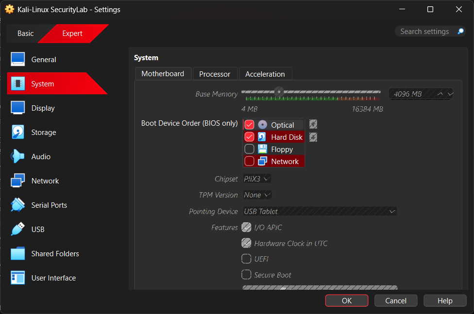
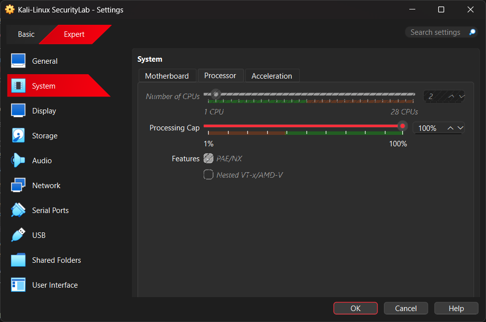
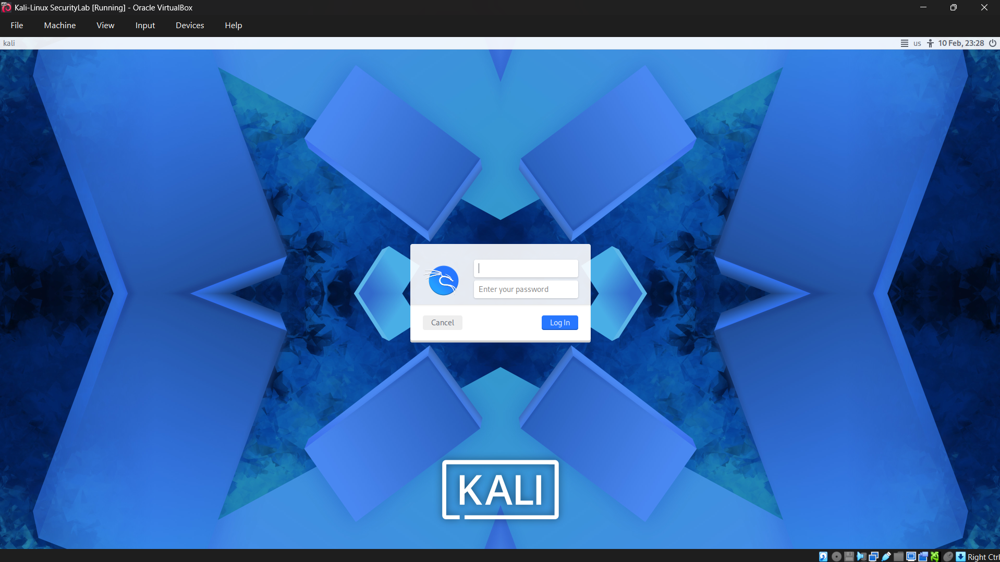
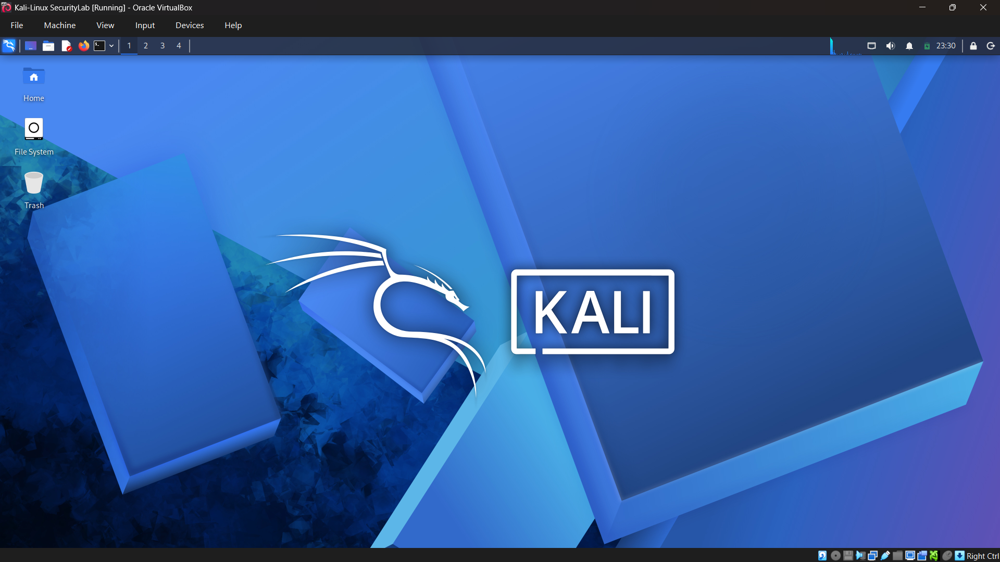
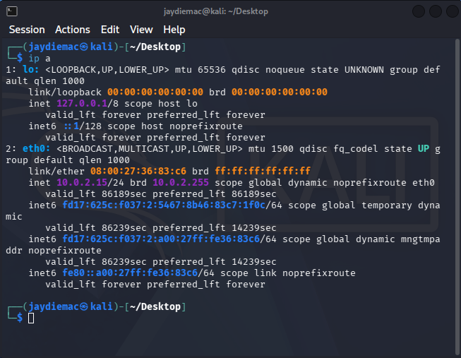

# Kali Linux Setup

## Purpose

Kali Linux serves as the attacker and analysis machine within the Security+ lab.
It contains pre-installed tools used for reconnaissance, scanning, and packet analysis.

## Virtual Machine Configuration

- Name: Kali-Linux-SecurityLab
- OS Type: Debian (64-bit)
- RAM: 4GB
- CPUs: 2
- Storage: 30GB (Dynamically Allocated)
- Network: NAT (initial configuration)

## Installation Method

Kali was installed using the graphical installer ISO.
Guided partitioning was selected with all files in a single partition.
GRUB bootloader was installed to /dev/sda.

## System Update

The system was updated using:

sudo apt update && sudo apt upgrade -y

This ensures the latest security patches and tool versions.

## Tool Verification

The following tools were verified:

- Nmap
- Wireshark

These tools will be used in future lab exercises to simulate reconnaissance
and analyze network traffic.

## Screenshots

### VM Configuration

### VM Configuration

### Login Screen

### Kali Desktop

### Network Verification

